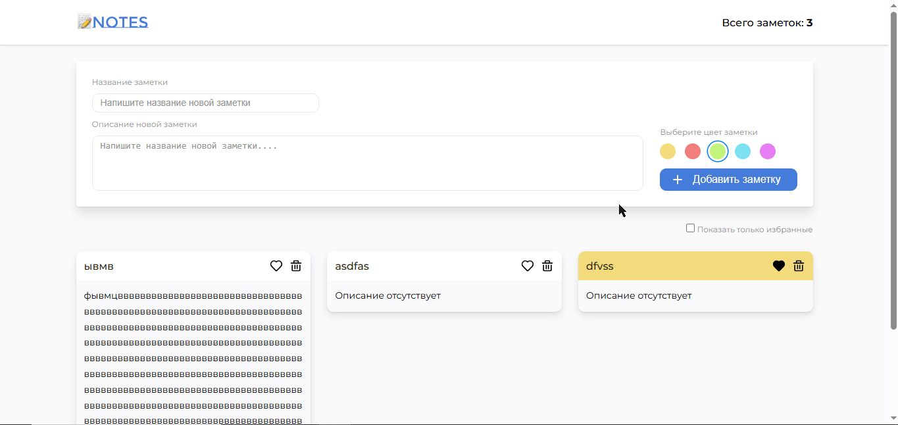
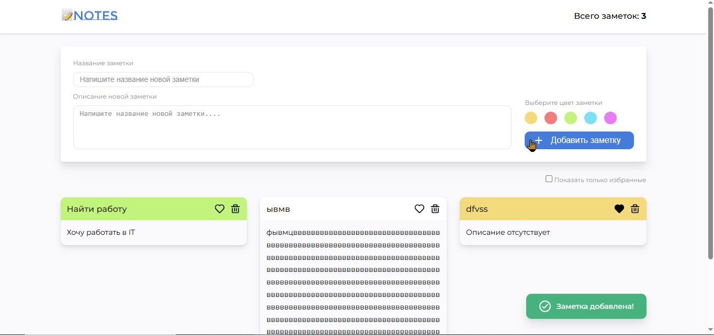
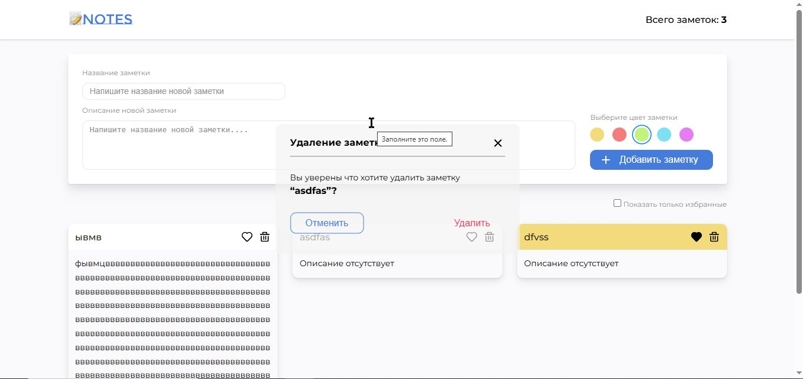

# Coder'sNotes

**Coder'sNotes** — это компактное веб-приложение для создания, управления и сохранения заметок. Проект демонстрирует практические навыки HTML, CSS и чистого JavaScript, включая работу с моделью MVC-подобной архитектуры, локальным хранилищем браузера и интерактивным пользовательским интерфейсом.

## Описание проекта

Приложение позволяет пользователю:

- создавать новые заметки с заголовком и описанием;
- выбирать цвет заметки для визуальной организации;
- помечать заметки как избранные;
- фильтровать список по избранным заметкам;
- удалять заметки с подтверждением удаления;
- сохранять заметки в `localStorage`, чтобы данные сохранялись между перезагрузками.

## Ключевые возможности

- **Адаптивный интерфейс**: аккуратный макет на основе семантической HTML-структуры.
- **Локальное хранение**: автоматическое сохранение заметок в браузерном `localStorage` для восстановления данных.
- **Подсчёт заметок**: динамическое отображение количества созданных записей.
- **Всплывающие сообщения**: мгновенная обратная связь для успешных действий и ошибок.

## Технологии

- HTML5
- CSS3
- JavaScript (ES6+)
- `localStorage`
- Семантическая структура DOM

## Как запустить

1. Откройте `index.html` в браузере.
2. Введите заголовок и описание заметки.
3. Выберите цвет заметки.
4. Нажмите кнопку `Добавить заметку`.
   > https://vlad615.github.io/Notes/ открыть ссылку на GHPages
   > Приложение не требует сборки или установки. Достаточно открыть `index.html` в браузере.

## Структура проекта

- `index.html` — основная страница, содержит разметку пользовательского интерфейса.
- `styles/` — стили проекта:
  - `style.css`
  - `header.css`
  - `main.css`
- `scripts/` — JavaScript-функционал:
  - `script.js` — инициализация приложения и загрузка данных из `localStorage`.
  - `model.js` — управление данными заметок, хранение, фильтрация, сохранение и удаление.
  - `controler.js` — логика проверки и обработки действий пользователя.
  - `view.js` — рендер заметок, управление DOM, отображение сообщений и диалогов подтверждения.
- `accets/` — графические ресурсы, иконки и логотип.
- `public/` — дополнительные статические файлы, если они используются в будущем.

## Архитектура и реализация

Проект реализован в духе MVC-подхода:

- `model.js` отвечает за состояние заметок и взаимодействие с `localStorage`.
- `view.js` отвечает за построение DOM, рендер заметок и интерфейсные диалоги.
- `controler.js` связывает события пользователя с бизнес-логикой и проверкой данных.
- `script.js` инициализирует приложение и загружает сохранённые заметки.

### Валидация данных

Перед добавлением новой заметки выполняется проверка:

- заголовок не может быть пустым и не более `50` символов;
- описание не может превышать `500` символов.

При нарушении этих правил отображается пользовательское сообщение об ошибке.

### Работа с локальным хранилищем

Данные сохраняются и загружаются через `localStorage`:

- `model.loadStorage()` — загружает заметки при старте приложения;
- `model.saveStorage()` — сохраняет текущее состояние заметок после добавления, удаления или изменения.

## Screenshots

